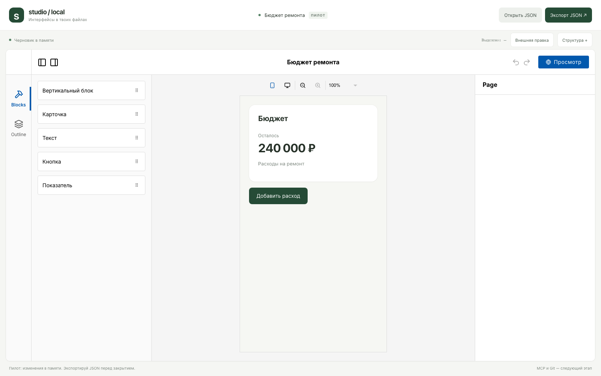
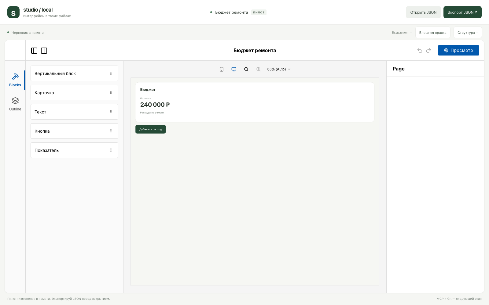

# Результат технического пилота

Дата: 2026-10-03. Этап A выполнен; Puck пригоден для дальнейшего прототипирования
студии с отдельной моделью документов.

## Подтверждённые результаты

| Проверка | Результат |
| --- | --- |
| Собственный Screen → Puck → Screen | Сохранены структура, свойства и ID вложенных узлов |
| Ручное редактирование вложенного Text | Текст обновляется, ID и фокус ввода сохраняются |
| Выделение вложенного узла | Public API selectedItem возвращает ID `note` |
| Внешняя правка | Меняется только заданный Metric, остальные данные сохранены |
| Перенос экрана | Экспортированный JSON открывается в новой browser context |
| Неверный импорт | Ошибка видна; прежний экран остаётся |
| Неверный ввод в редакторе | Холст восстановлен из последнего корректного документа |
| Ширины 390 и 1280 | Проверены CSS-width iframe, переключение и запись ширины в JSON |
| Другой тип узла с ID total | Внешняя правка отклоняется без потери документа |

Финальные команды: `npm test` — exit 0, 9 тестов в 3 файлах;
`npm run test:browser` — exit 0, 7 браузерных сценариев;
`npm run build` — exit 0, включая `tsc --noEmit`.

Проверки модели и bridge сначала запускались с отсутствующей реализацией и падали,
затем прошли. Регрессии ширины, отклонённого ввода и неправильного типа `total`
были воспроизведены отдельными падающими браузерными тестами перед исправлением.

## Версии

Node.js 24.2.0; React/React DOM 19.3.0; Puck 0.23.0; TypeScript 7.0.2;
Vite 8.3.2; Vitest 5.0.3; Playwright 1.63.0. Остальные версии закреплены в lockfile.
Браузерный прогон выполнен в Chromium на macOS.

## Ревью

Независимое ревью указало на потерю root-свойств, расхождение отклонённого ввода
и документа, а также предположение о типе элемента с ID total. Root-поля отключены,
при отклонении ввода восстанавливается канонический экран, внешняя правка проверяет
тип Metric. Последние два случая покрыты браузерными регрессиями.

## Ограничения

Данные до экспорта находятся в React state. Нет автосохранения, общей истории,
файлового сервиса, MCP, GitHub-синхронизации и адаптера продукта. Внешняя правка
является локальной демонстрационной командой и не доказывает интеграцию с AI-клиентом.

У Puck `data` является начальным значением. Пилот обновляет внешнюю правку через
remount, что сбрасывает выделение, внутреннюю историю undo/redo и может менять скролл.
Такой способ принят только для пилота. Этап B/C должен синхронизировать редактор
с общим движком операций через документированный dispatch с учётом ревизий.

AppState Puck нестабилен. Зависимость от выделения изолирована через
`createUsePuck` и selectedItem; в файлы экрана AppState не записывается.
Неподдерживаемые компоненты и версия схемы отклоняются; в полном MVP необходимы
сохранение неизвестных узлов и миграции, предусмотренные спецификацией.

React StrictMode и большие/глубокие документы не входят в выполненную приёмку.
UI-импорт ограничен 1 МБ; сложные документы требуют дополнительных лимитов на этапе B.
Наличие стороннего пакета deep-diff 1.0.2 вызывает предупреждение npm о прекращении
поддержки; установка завершилась без найденных npm vulnerabilities.
Vite предупреждает о главном bundle примерно 681 kB (192 kB gzip); оптимизация
загрузки редактора остаётся задачей поставки MVP. Playwright печатает предупреждение
о переменных цвета терминала; оно не связано с состоянием приложения.

## Визуальная проверка

Скриншоты осмотрены: читаемый текст, вложенная карточка, панели редактора и кнопка
помещаются в превью. Desktop-холст масштабируется Puck для размещения между панелями.

## Следующая работа

Подготовить и выполнить этап B: файловое хранилище с атомарной записью, единый движок
операций, ревизии, undo/redo, повторные запросы и восстановление. Это необходимая
основа для доступа через MCP и публикации документов в GitHub на этапах C/D.
